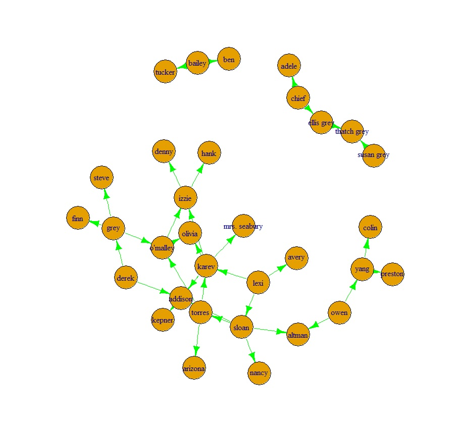
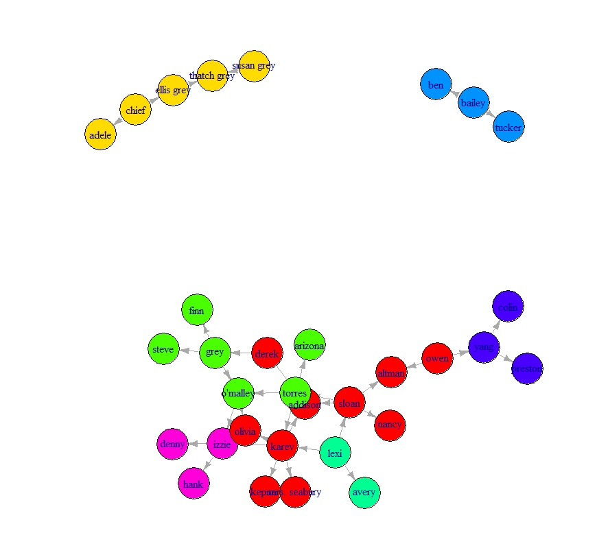
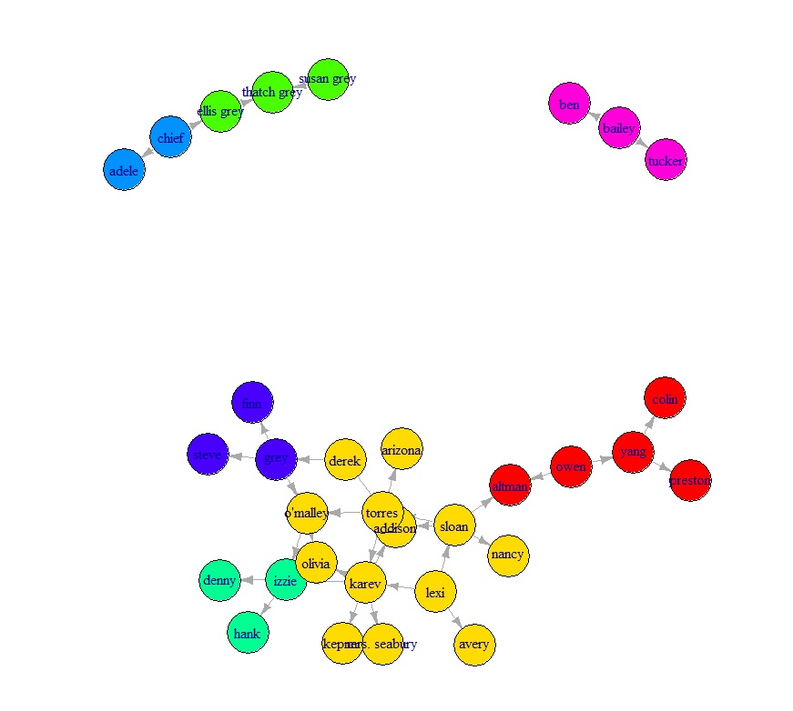

# ex3
#### question 1
- [ ] a:  
the plot : 
 
- betweeness :  Karev 
- Closness : Lexi 
- Eigencetor : Steve + Fin 
 
- [ ] b: 
### Girvan-Newman 
- The color plot: 
 
- we got 5 communities
- and the modularity value was 0.5064879 
### walktrap 
- the color plot: 
 
- we got 7 communities
- the modularity value was 0.5147059 
