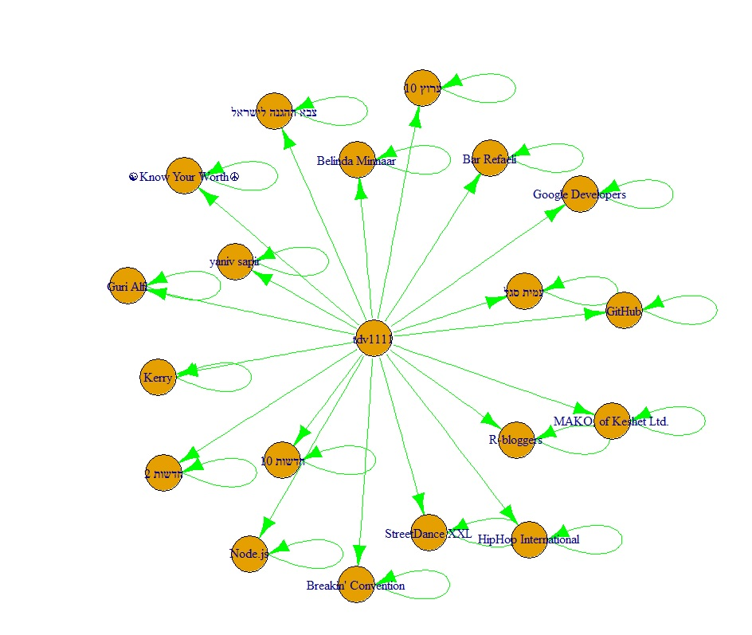
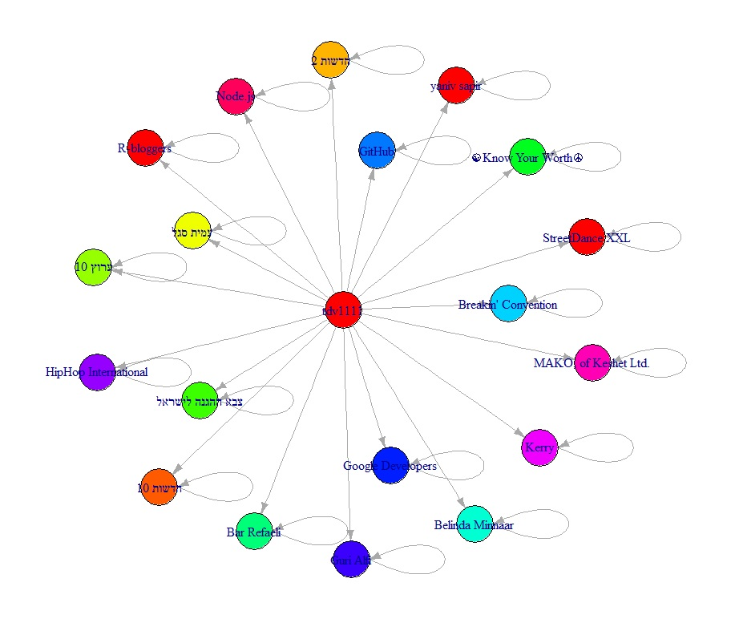

# ex3
## question 1
- [ ] a: 
- the plot :

- betweeness :  Karev
- Closness : Lexi
- Eigencetor : Steve + Fin
- for more info see file name [ex3 q1 b-ex3 q1 a.R](https://github.com/tDv11/ex3/blob/master/ex3%20q1%20a.R)

- [ ] b:

### Girvan-Newman algorithm

- The color plot:

- we got 5 communities
- and the modularity value was 0.5064879
- for more info see file name [ex3 q1 b-Girvan-Newman algorithm.R](https://github.com/tDv11/ex3/blob/master/ex3%20q1%20b-Girvan-Newman%20algorithm.R)

### walktrap algorithm

- the color plot:

- we got 7 communities
- the modularity value was 0.5147059
- for more info see file name [ex3 q1 b-walktrap community.R](https://github.com/tDv11/ex3/blob/master/ex3%20q1%20b%20-walktrap%20community.r)

## question 2
- [ ] a: 
- the plot :

- betweeness :  tdv1111
- Closness : tdv1111
- Eigencetor : tdv1111
- for more info see file name [twitter.R](https://github.com/tDv11/ex3/blob/master/twitter.R)

- [ ] b:

### Girvan-Newman algorithm
- The color plot:

- we got 12 communities
- the modularity value was 0.4182825
- for more info see file name [ex3 q2 b-girvan newman.R](https://github.com/tDv11/ex3/blob/master/ex3%20q2%20b-girvan%20newman.R)

### walktrap algorithm
- The color plot:

- we got 7 communities
- the modularity value was 0.5147059
